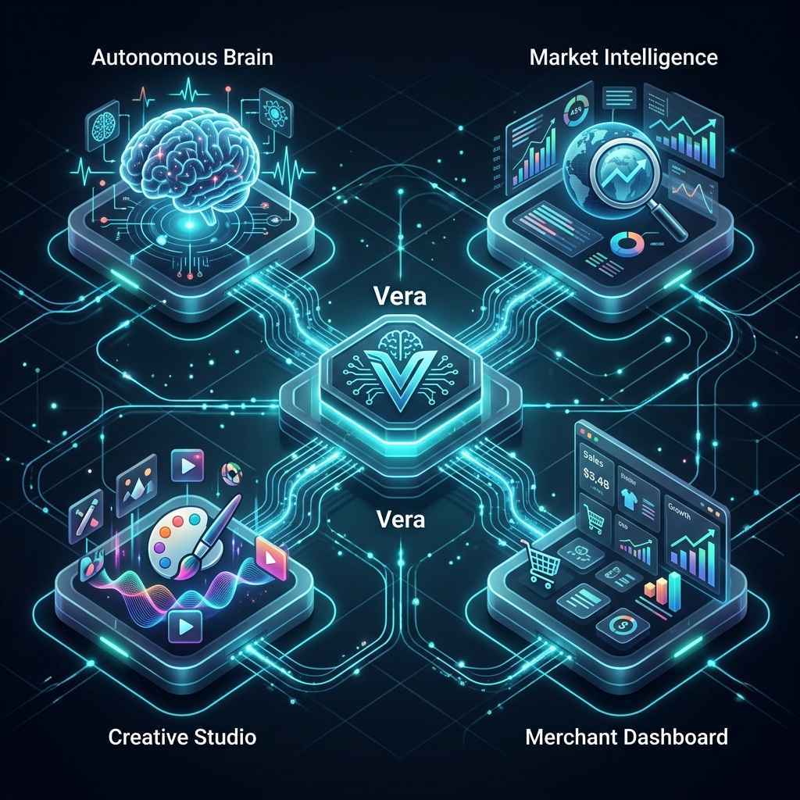
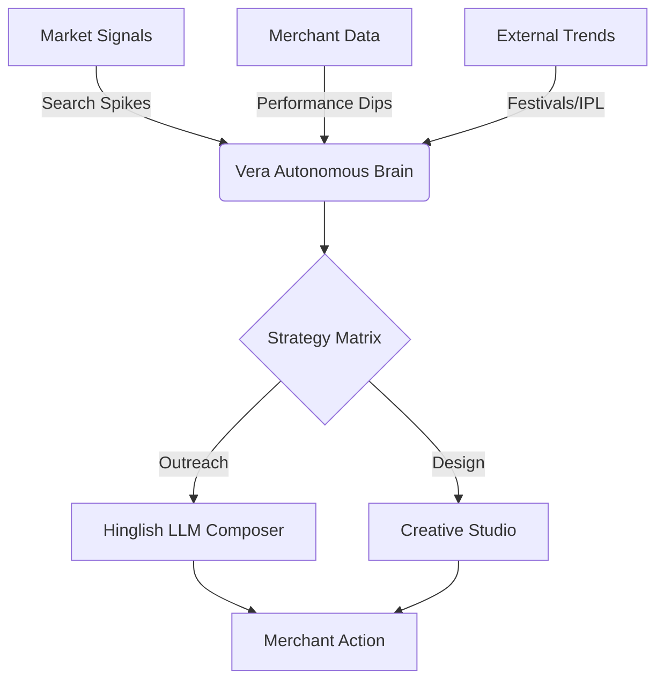
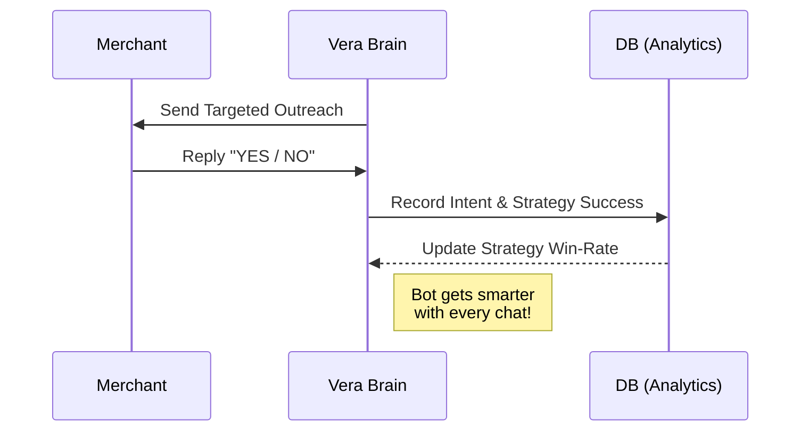
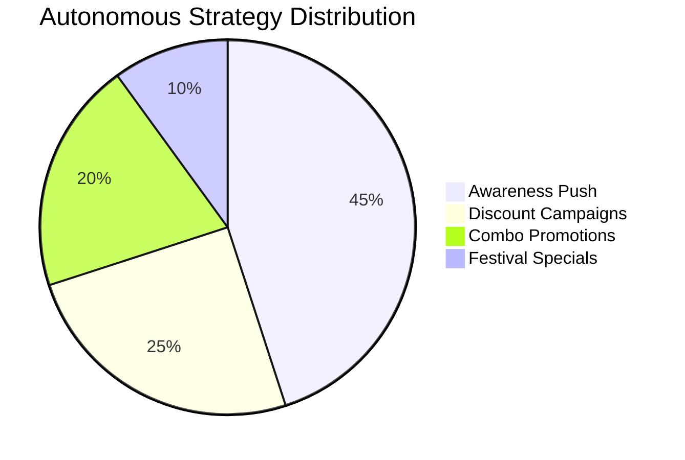

# 🚀 Vera: The World's First Autonomous Growth Agent for Magicpin

**Vera** is not just a chatbot. She is a **Strategic Business Partner** that autonomously manages marketing, predicts market trends, and designs professional campaigns for Magicpin merchants.
 
---

## 📊 Core Architecture & Logic

### 1. The Decision Pipeline

### 2. The Self-Learning Feedback Loop

### 3. Strategy Optimization

---

## 🌟 The Vision (For Everyone)
Running a restaurant or a salon is hard. Merchants don't have time to look at data, design ads, or chat with customers all day. **Vera solves this.** 

Vera lives inside the Magicpin ecosystem. She watches the market 24/7. When she sees a "Goldmine" opportunity—like a sudden spike in people searching for "Momos" nearby—she doesn't just tell the merchant; she **designs the campaign, writes the message, and offers to launch it.**

---

## 🧠 The Intelligence (For Technical Judges)
Vera is built on a **High-Performance Hybrid Agentic Architecture**:

### 1. The Autonomous Decision Engine
Vera uses a multi-layered scoring system to evaluate signals from:
*   **Market Intelligence**: Real-time city-wide search volumes and trending items.
*   **Performance Metrics**: Views, conversion rates, and sales deltas.
*   **Competitor Intel**: Real-time detection of aggressive rival discounting.

### 2. The Hybrid LLM Brain
Using a **Hybrid Synthetic Intelligence** model, Vera communicates in natural **Hinglish**. 
*   **Deterministic Guardrails**: Ensures accuracy and speed.
*   **LLM Synthesis**: Uses Claude 3.5 Sonnet to compose persuasive, data-anchored outreach that feels human.

### 3. Self-Learning Optimization
Vera features a **Closed-Loop Feedback System**. Every time a merchant says "YES" or "NO," the engine records the success rate of the strategy. Over time, Vera autonomously prioritizes the strategies that yield the highest conversion for that specific category.

---

## 🛠️ Key Features

### 🎨 Vera Creative Studio
Vera autonomously designs professional, high-contrast marketing posters. No design skills needed—just one click and the merchant has a ready-to-post ad with a custom QR code.

### 🔮 Vera Future-Sight
Predictive analytics that forecast upcoming events (IPL Finals, Monsoon Sales, Festivals). Vera warns merchants about future spikes so they can prep inventory and staff in advance.

### 🎤 Multimodal Voice Mode
Vera isn't just text. The "Vera Control Center" includes a **Voice Mode** where merchants can talk to Vera naturally and hear her Hinglish suggestions in a professional AI voice.

### ⚙️ Autonomous Execution
When a merchant commits, Vera handles the "dirty work." The engine performs the catalog checks, applies discount filters, and syncs with the Magicpin Gateway autonomously.

---

## 🚀 Deployment & Tech Stack
*   **Engine**: Python / Flask
*   **Persistence**: SQLite (Persistent Thread-Safe Storage)
*   **UI**: Premium Vanilla JS/CSS Dashboard (Dark Mode)
*   **Intelligence**: Claude 3.5 Sonnet / Synthetic Fallback
*   **Voice**: Web Speech API (Multimodal)
*   **Infrastructure**: Fully optimized for **Vercel** and **Render**.

---

## 👨‍💻 Get Started
1. **Clone & Install**: `pip install -r requirements.txt`
2. **Launch Vera**: `python bot.py`
3. **Open Control Center**: Visit `http://localhost:5050`
4. **Simulate Growth**: Click **"Simulate Random Trigger"** and watch the magic happen.

---

### Developed for the Magicpin AI Challenge 2026
**"Moving Merchants from Data-Overwhelmed to Growth-Driven."**
